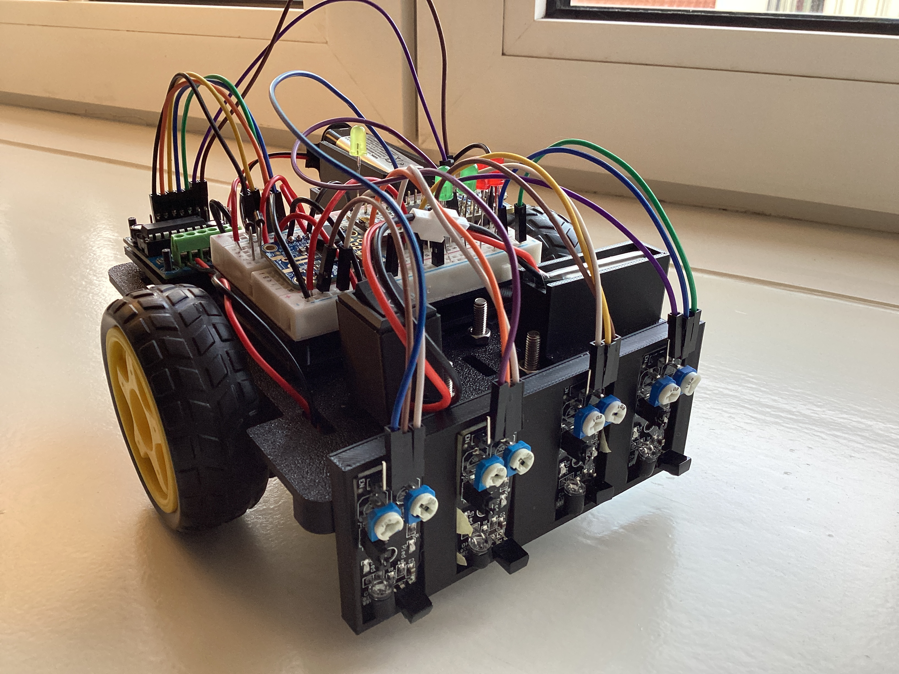
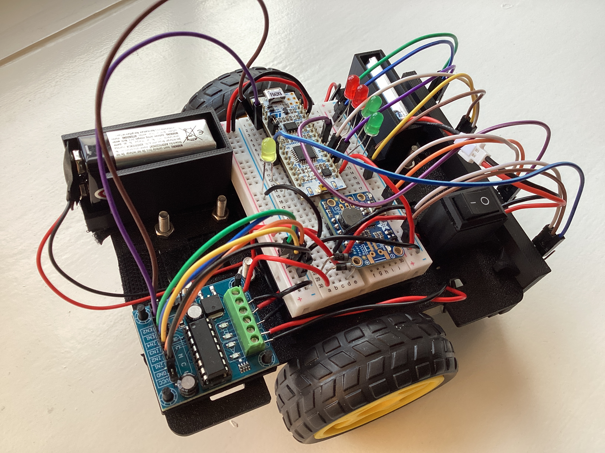
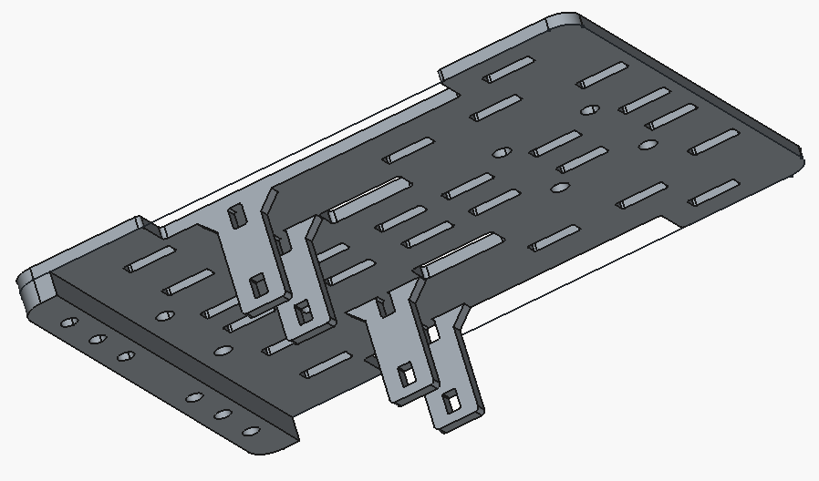
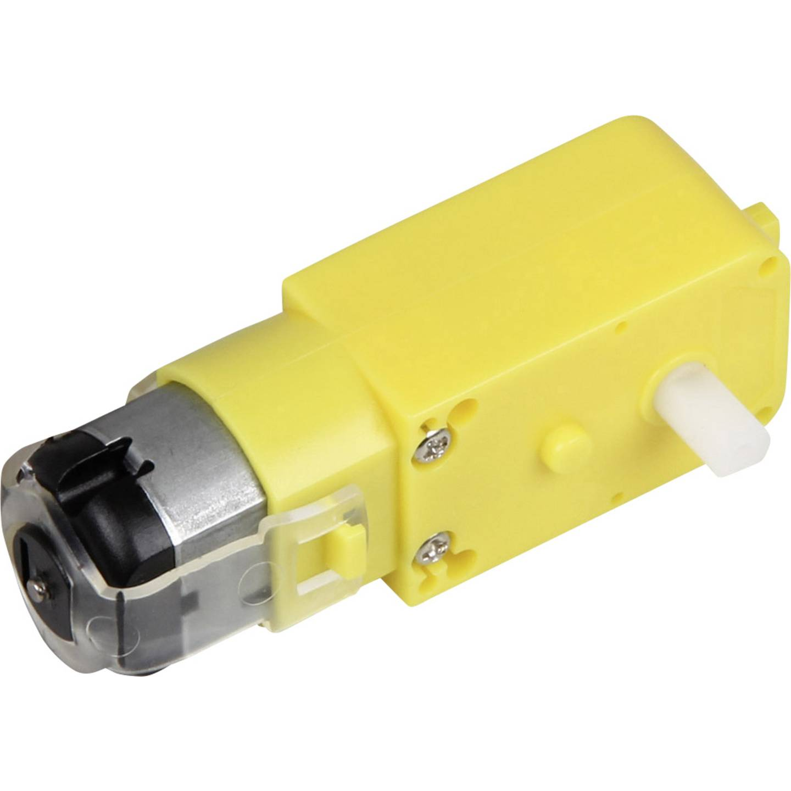
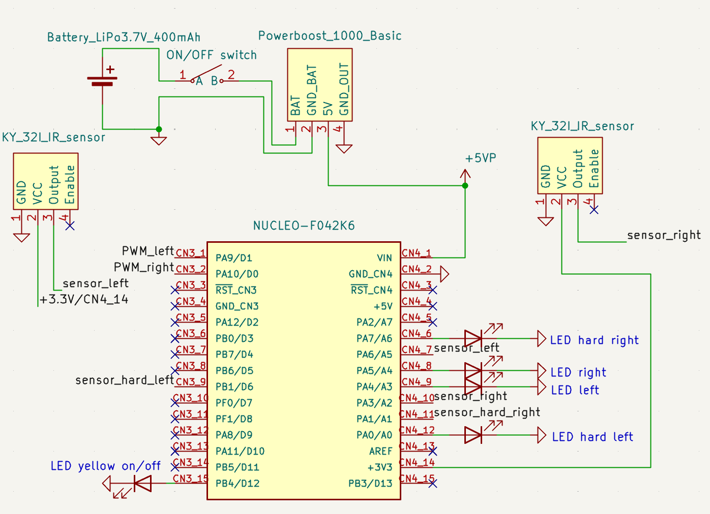
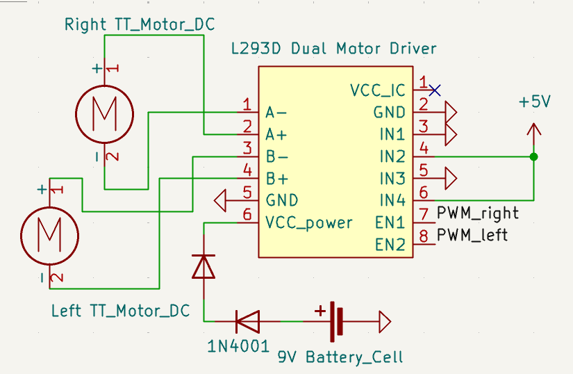
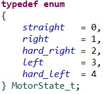
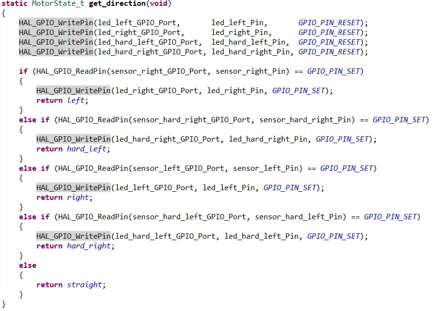

# Line Follower Robot — 3D Printed, Embedded Control System

This repository contains the design files, embedded firmware, and hardware documentation for a compact, custom build  follower robot.  The system is built around a custom 3D-printed chassis, IR reflectance sensors, and dual DC motors driven through an L293D H-bridge. Control logic is implemented using a non-blocking state machine running on an STM32F042 microcontroller.  

---

## System Overview
This project presents a fully self-designed mobile robot engineered to follow a black line on the floor. The platform combines custom 3D-printed mechanics with sensor-driven motor control to achieve reliable autonomous navigation.

  
  

---

## Mechanical Design
A basic 3D-printed chassis was designed in [FreeCAD](https://www.freecad.org/).  
In addition, several smaller components were created to mount the batteries, motor driver, breadboard, on/off switch, and sensors.

  

All design files are available as FreeCAD models in the [FreeCAD](FreeCAD/) folder.

---
## Motors and Motor Driver
The propulsion system consists of standard brushed TT-motors driven using a 50 Hz PWM signal at an operating voltage of approximately 7 V.  
Motor actuation is handled by a pre-assembled L293D H-bridge module.

  

---

## Sensor System
The robot uses four KY-032 digital infrared proximity sensors for line detection.  
Each sensor provides a binary output indicating whether the reflective surface beneath it corresponds to the track or the background.

The two inner sensors form the primary feedback loop for maintaining a straight trajectory by providing high-resolution deviation information near the center of the line.  
The two outer sensors extend the detection range, enabling early identification of sharp curves and allowing the control logic to initiate more aggressive corrective turns.

---
## Power System
The motor subsystem is supplied by a 9 V battery, with the voltage reduced to approximately 7 V using two series-connected 1N4001 silicon diodes.  
This approach provides a simple fixed-voltage drop suited for brushed DC motors, where load-dependent variations are acceptable.

The microcontroller subsystem is powered by a 3.7 V, 400 mAh LiPo cell.  
Its output is regulated to a stable 5 V using a pre-assembled DC-DC boost converter, ensuring consistent logic-level supply and isolation from motor-induced voltage fluctuations.

---

## Electronics and Circuit Integration
The complete electronic system integrates the microcontroller, sensor array, and power distribution network.  
A detailed schematic of the control electronics is shown below:

  

The motor power stage, including the voltage-drop diodes and H-bridge driver connections, is illustrated in the following schematic:

  

---

## Control Logic
An STM32 Nucleo-F042K6 development board was used as the main controller for this project.  
Motor actuation was implemented as a non-blocking state machine to ensure deterministic PWM updates and responsive sensor handling under all operating conditions.

The high-level control behavior is modeled as a finite state machine, illustrated below:

  

The LED indicators were arranged such that only one LED could be active at any given time, providing a direct visual representation of the current control state.

On the microcontroller, the state machine is represented using an enumeration structure, shown below:

  

State transitions are driven by the sensor-evaluation function, which maps the four digital IR sensor inputs to the appropriate motor-control state:

  

The specific PWM duty cycles for each turning mode were determined empirically through iterative testing to achieve smooth and stable motion.

The complete firmware implementation is available in the [Firmware](Firmware/) directory.

---

## Demonstration
A demonstration of the robot’s behavior and line-following performance is provided below:

## Conclusion
The line follower robot performed as expected, but several limitations became apparent during testing.  
The absence of closed-loop feedback, combined with the low-quality TT motors, significantly affected control accuracy.  
Without proper PID regulation, the system exhibited noticeable overshoot during initial PWM tuning, and the motors did not provide sufficient torque for precise high-speed maneuvers.

Despite these limitations, the project successfully demonstrated the core functionality of a sensor-driven line follower and provided valuable insight into motor control, embedded implementation, and mechanical design considerations.

## Future Work
Several extensions and improvements could be explored in future iterations of the project:

- Implementing closed-loop PID control to achieve more stable and responsive motor behavior  
- Replacing the microcontroller with an FPGA to evaluate hardware-accelerated control logic  
- Developing a fully analog implementation of the control system and sensor interface as an alternative design approach

---

## License
This project is released under the MIT License.  
See `LICENSE` for details.

